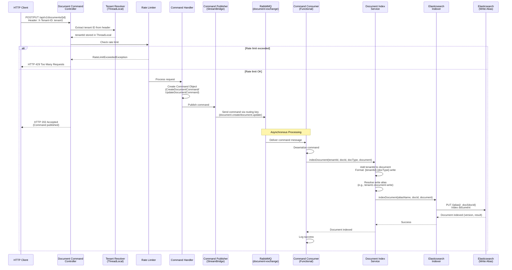
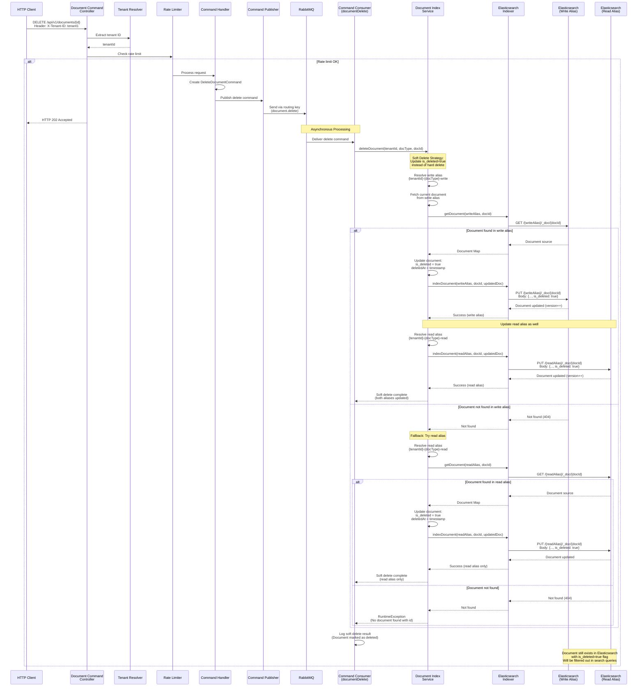
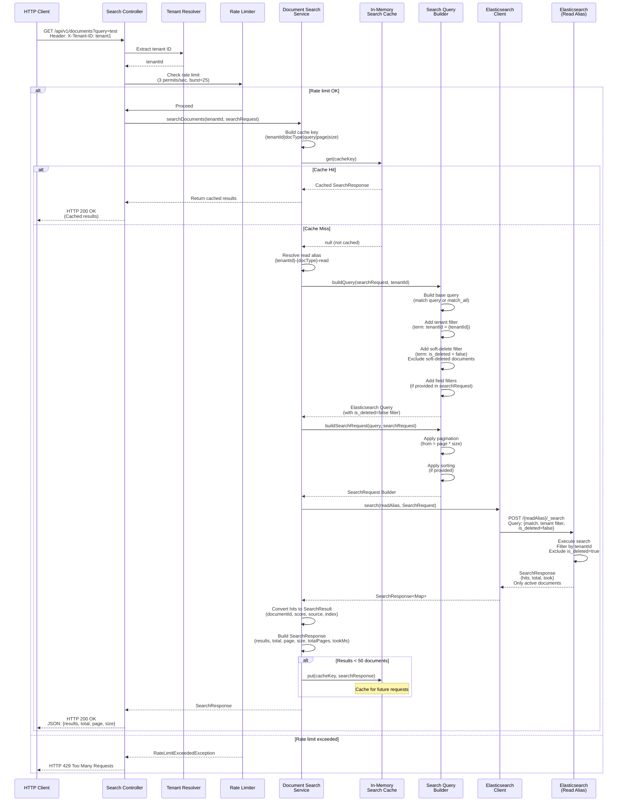
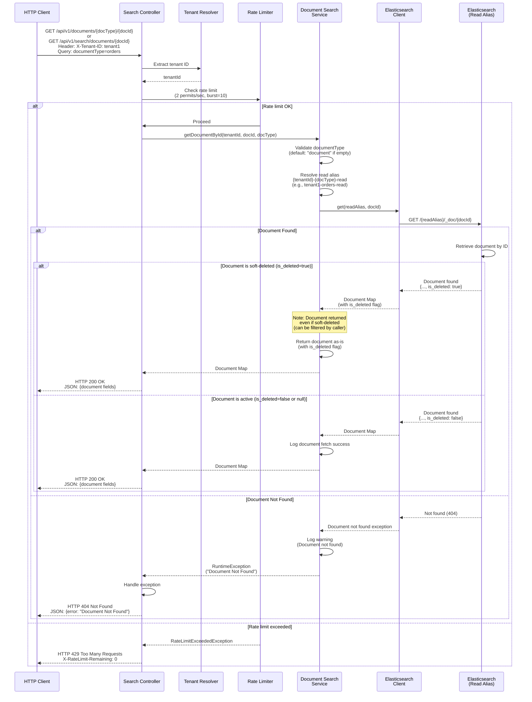

# DIS-DOSS System Architecture

## High-Level System Architecture Diagram

```mermaid
graph TB
    subgraph ClientLayer["Client Layer"]
        Client["HTTP Clients<br/>REST API"]
    end

    subgraph WebModule["Web Module<br/>Port 8080"]
        REST["Document Controller<br/>Search Controller"]
        TenantInterceptor["Tenant Resolver"]
        CommandHandler["Command Handlers"]
        RateLimit["Rate Limiter"]
        CommandPublisher["Command Publisher"]
    end

    subgraph RabbitMQ["Message Queue - RabbitMQ"]
        Exchange["document-exchange"]
        CreateQueue["document.create"]
        UpdateQueue["document.update"]
        DeleteQueue["document.delete"]
    end

    subgraph CoreModule["Core Module"]
        ESConfig["Elasticsearch Config"]
        TenantConfig["Tenant Config"]
        CoreException["Exception Handler"]
        RateLimitConfig["Rate Limit Config"]
    end

    subgraph IndexerModule["Doc-Indexer Module"]
        IndexerConsumer["Command Consumers"]
        IndexService["Document Index Service"]
        ESIndexer["Elasticsearch Indexer"]
    end

    subgraph SearcherModule["Doc-Searcher Module"]
        SearchController2["Search Controller"]
        SearchService["Document Search Service"]
        QueryBuilder["Search Query Builder"]
        SearchCache["Search Cache"]
    end

    subgraph StorageLayer["Data Storage"]
        ES[("Elasticsearch<br/>Read/Write Aliases")]
    end

    %% Client to Web
    Client -->|HTTP| REST
    REST --> TenantInterceptor
    REST --> RateLimit
    REST --> CommandHandler
    REST --> CommandPublisher
    REST -->|Search| SearchController2

    %% Web to Message Queue
    CommandPublisher -->|Publish| Exchange
    Exchange --> CreateQueue
    Exchange --> UpdateQueue
    Exchange --> DeleteQueue

    %% Message Queue to Indexer
    CreateQueue -->|Consume| IndexerConsumer
    UpdateQueue -->|Consume| IndexerConsumer
    DeleteQueue -->|Consume| IndexerConsumer

    %% Indexer Flow
    IndexerConsumer --> IndexService
    IndexService --> ESIndexer
    ESIndexer -->|Write/Delete| ES

    %% Searcher Flow
    SearchController2 --> SearchService
    SearchService --> QueryBuilder
    SearchService --> SearchCache
    SearchService -->|Read| ES

    %% Core Module Dependencies
    ESConfig -.->|Configures| ESIndexer
    ESConfig -.->|Configures| SearchService
    TenantConfig -.->|Resolves| IndexService
    TenantConfig -.->|Resolves| QueryBuilder
    CoreException -.->|Handles| REST

    %% Styling with better contrast
    classDef webModule fill:#4A90E2,stroke:#2E5C8A,stroke-width:3px,color:#FFFFFF
    classDef coreModule fill:#F5A623,stroke:#A0681A,stroke-width:3px,color:#000000
    classDef indexerModule fill:#9012FE,stroke:#5A0A9E,stroke-width:3px,color:#FFFFFF
    classDef searcherModule fill:#50E3C2,stroke:#2A9E84,stroke-width:3px,color:#000000
    classDef storage fill:#BD10E0,stroke:#7A0A93,stroke-width:3px,color:#FFFFFF
    classDef mq fill:#F8E71C,stroke:#B8A614,stroke-width:3px,color:#000000

    class REST,TenantInterceptor,CommandHandler,RateLimit,CommandPublisher,SearchController2 webModule
    class ESConfig,TenantConfig,CoreException,RateLimitConfig coreModule
    class IndexerConsumer,IndexService,ESIndexer indexerModule
    class SearchService,QueryBuilder,SearchCache searcherModule
    class ES storage
    class Exchange,CreateQueue,UpdateQueue,DeleteQueue mq
```



## Component Details

### Web Module (Port 8080)
- **Document Command Controller**: Receives HTTP requests for create/update/delete operations
- **Search Controller**: Handles search queries via REST API
- **Tenant Resolver**: Extracts tenant ID from `X-Tenant-ID` header and stores in ThreadLocal
- **Rate Limiter**: Token bucket rate limiting per endpoint
- **Command Publisher**: Publishes commands to RabbitMQ via Spring Cloud Stream

### Core Module
- **Elasticsearch Config**: Shared Elasticsearch client configuration for all modules
- **Tenant Config**: Manages tenant resolution via HTTP headers (ThreadLocal pattern)
- **Exception Handler**: Centralized exception handling
- **Rate Limit Config**: Rate limiting configuration and registry

### Doc-Indexer Module
- **Command Consumers**: Functional consumers that process commands from RabbitMQ
  - `documentCreate`: Creates new documents
  - `documentUpdate`: Updates existing documents
  - `documentDelete`: Hard deletes documents from both write and read aliases
- **Document Index Service**: Resolves index aliases based on tenant and document type
- **Elasticsearch Indexer**: Low-level Elasticsearch operations

### Doc-Searcher Module
- **Search Controller**: REST endpoints for document search
- **Document Search Service**: Orchestrates search operations
- **Search Query Builder**: Builds Elasticsearch queries with tenant filtering
- **In-Memory Search Cache**: LRU cache for frequently accessed searches

### Data Storage

#### Elasticsearch
- **Index Aliases**: 
  - Write aliases: `{tenantId}-{documentType}-write`
  - Read aliases: `{tenantId}-{documentType}-read`
- **Document Structure**:
  - Contains `tenantId` field for tenant identification
  - Each tenant has dedicated aliases ensuring complete data isolation
  - Documents are permanently deleted (hard delete) from both read and write aliases

### Message Queue (RabbitMQ)
- **Exchange**: `document-exchange`
- **Routing Keys**:
  - `document.create`
  - `document.update`
  - `document.delete`
- **Consumer Groups**:
  - `indexer-group`: Processes indexing commands
  - `searcher-group`: Processes search-related events (future use)

## Data Flow Diagrams

### Document Indexing Flow (Create/Update)



### Document Soft Delete Flow



### Document Search Flow



### Get Document by ID Flow



### Data Flow Summary

#### Indexing Operations (Create/Update)
1. **HTTP Request** → Client sends POST/PUT with document data and `X-Tenant-ID` header
2. **Tenant Resolution** → Tenant ID extracted and stored in ThreadLocal
3. **Rate Limiting** → Request rate checked against token bucket
4. **Command Creation** → Command object created (CreateDocumentCommand/UpdateDocumentCommand)
5. **Async Publishing** → Command published to RabbitMQ via routing key
6. **Immediate Response** → HTTP 202 Accepted returned to client
7. **Consumer Processing** → Command consumer receives and deserializes command
8. **Alias Resolution** → Write alias resolved: `{tenantId}-{documentType}-write`
9. **Document Preparation** → tenantId and is_deleted flag added to document
10. **Elasticsearch Indexing** → Document indexed via write alias
11. **Success Logging** → Operation logged for monitoring

#### Soft Delete Operations
1. **HTTP Request** → Client sends DELETE with document ID and `X-Tenant-ID` header
2. **Same Initial Flow** → Tenant resolution, rate limiting, command creation
3. **Async Publishing** → DeleteCommand published to RabbitMQ
4. **Consumer Processing** → Delete consumer receives command
5. **Document Fetch** → Fetch current document from write alias first
6. **Soft Delete Update** → Update document with `is_deleted=true` and `deletedAt=timestamp`
7. **Write Alias Update** → Update document in write alias with soft delete flag
8. **Read Alias Update** → Update document in read alias with soft delete flag
9. **Fallback Strategy** → If not found in write alias, try read alias
10. **Error Handling** → Throws exception if document not found in either alias
11. **Document Retention** → Document remains in Elasticsearch but marked as deleted

#### Search Operations
1. **HTTP Request** → Client sends GET with query parameters and `X-Tenant-ID` header
2. **Tenant Resolution** → Tenant ID extracted for query filtering
3. **Rate Limiting** → Search rate limited (3/sec, burst=25)
4. **Cache Check** → Cache key built from tenant, query, pagination params
5. **Cache Hit Path** → If cached, return immediately (no Elasticsearch call)
6. **Cache Miss Path** → Build Elasticsearch query:
   - Resolve read alias: `{tenantId}-{documentType}-read`
   - Build base query (match or match_all)
   - Add tenant filter (term query)
   - Add soft-delete filter (term: is_deleted=false) to exclude deleted documents
   - Apply field filters and pagination
7. **Elasticsearch Query** → Execute search against read alias (excludes soft-deleted documents)
8. **Result Processing** → Convert hits to SearchResult objects (only active documents)
9. **Response Building** → Build SearchResponse with pagination metadata
10. **Caching** → Cache results if < 50 documents for future requests
11. **Response** → Return JSON response to client (only active documents)

#### Get Document by ID Operations
1. **HTTP Request** → Client sends GET to `/api/v1/documents/{docType}/{docId}` or `/api/v1/search/documents/{docId}` with `X-Tenant-ID` header
2. **Tenant Resolution** → Tenant ID extracted from header
3. **Rate Limiting** → Get operation rate limited (2/sec, burst=10)
4. **Document Type Validation** → Default to "document" if documentType is empty or null
5. **Alias Resolution** → Resolve read alias: `{tenantId}-{documentType}-read`
6. **Elasticsearch Get** → Execute GET request against read alias using document ID
7. **Document Retrieval** → Elasticsearch returns document if found (includes soft-deleted documents with `is_deleted=true`)
8. **Response Handling**:
   - **Document Found**: Return document as-is (including soft-deleted flag if present)
   - **Document Not Found**: Return HTTP 404 with error message
9. **Response** → Return JSON response with document fields to client

## API Reference

### Search APIs

#### Search Documents
Search for documents using query parameters and filters.

**Endpoint:** `GET /api/v1/documents`

**Headers:**
- `X-Tenant-ID: {tenantId}` (required)

**Query Parameters:**
- `query` (optional): Search query string (URL encoded)
- `documentType` (optional): Document type filter (default: "document")
- `fields` (optional): Comma-separated list of fields to search in
- `page` (optional): Page number (default: 0)
- `size` (optional): Page size (default: 10)

**Example:**
```bash
curl -X GET "http://localhost:8080/api/v1/documents?query=LIGHT%20CHAIN&documentType=orders&fields=description&page=0&size=10" \
     -H "X-Tenant-ID: tenant1"
```

#### Advanced Search
Advanced search with POST request body for complex queries.

**Endpoint:** `GET /api/v1/search`

**Headers:**
- `X-Tenant-ID: {tenantId}` (required)

**Query Parameters:**
- `query` (optional): Search query string
- `documentType` (optional): Document type filter
- `page` (optional): Page number (default: 0)
- `size` (optional): Page size (default: 10)

**Example:**
```bash
curl -X GET "http://localhost:8080/api/v1/search?query=MCP&documentType=elasticsearch&page=0&size=10" \
     -H "X-Tenant-ID: tenant1"
```

#### Get Document by ID
Retrieve a specific document by its ID.

**Endpoint:** `GET /api/v1/search/documents/{documentId}`

**Headers:**
- `X-Tenant-ID: {tenantId}` (required)

**Query Parameters:**
- `documentType` (optional): Document type (default: "document")

**Example:**
```bash
curl -X GET "http://localhost:8080/api/v1/search/documents/flyXM5oBA7T8gZvsef6r?documentType=elasticsearch" \
     -H "X-Tenant-ID: tenant1"
```

**Alternative Endpoint:**
```bash
curl -X GET "http://localhost:8080/api/v1/documents/{documentType}/{documentId}" \
     -H "X-Tenant-ID: tenant1"
```

**Example:**
```bash
curl -X GET "http://localhost:8080/api/v1/documents/orders/dc02ffbf-22db-43fe-a507-93ca958d0d7d" \
     -H "X-Tenant-ID: tenant1"
```

### Document Management APIs

#### Delete Document
Soft delete a document (marks `is_deleted=true`).

**Endpoint:** `DELETE /api/v1/documents/{documentType}/{documentId}`

**Headers:**
- `X-Tenant-ID: {tenantId}` (required)

**Path Parameters:**
- `documentType`: Document type (e.g., "orders", "document")
- `documentId`: Document ID to delete

**Example:**
```bash
curl -X DELETE "http://localhost:8080/api/v1/documents/orders/dc02ffbf-22db-43fe-a507-93ca958d0d7d" \
     -H "X-Tenant-ID: tenant1"
```

**Response:**
- `202 Accepted`: Delete command published successfully
- `429 Too Many Requests`: Rate limit exceeded
- `500 Internal Server Error`: Error processing delete command

#### Create/Update Document
Create or update a document.

**Endpoint:** `POST /api/v1/documents/{documentId}` or `PUT /api/v1/documents/{documentId}`

**Headers:**
- `X-Tenant-ID: {tenantId}` (required)
- `Content-Type: application/json`

**Path Parameters:**
- `documentId`: Document ID

**Request Body:**
```json
{
  "document": {
    "field1": "value1",
    "field2": "value2"
  },
  "documentType": "orders"
}
```

**Example:**
```bash
curl -X POST "http://localhost:8080/api/v1/documents/da252214-8f78-40d2-ae55-e149b56cf093" \
     -H "X-Tenant-ID: tenant1" \
     -H "Content-Type: application/json" \
     -d '{
       "document": {
         "description": "Sample order",
         "quantity": 10
       },
       "documentType": "orders"
     }'
```

**Response:**
- `202 Accepted`: Document command published successfully
- `429 Too Many Requests`: Rate limit exceeded
- `400 Bad Request`: Invalid request body
- `500 Internal Server Error`: Error processing command

### Elasticsearch Index Management

#### Create Index
Create a new Elasticsearch index.

**Endpoint:** `PUT /{indexName}` (Elasticsearch API)

**Headers:**
- `Authorization: ApiKey {apiKey}` (required)

**Example:**
```bash
curl -X PUT "localhost:9200/tenant1-orders-write-2025-10" \
     -H 'Authorization: ApiKey ZGx3VE1ab0JBN1Q4Z1p2c1JmNTA6R2RpSXRfLUFlZ1dVMjFZRFVOUzdVQQ'
```

#### Manage Aliases
Add or remove aliases for indexes.

**Endpoint:** `POST /_aliases` (Elasticsearch API)

**Headers:**
- `Authorization: ApiKey {apiKey}` (required)
- `Content-Type: application/json`

**Request Body:**
```json
{
  "actions": [
    {
      "add": {
        "index": "{indexName}",
        "alias": "{aliasName}"
      }
    }
  ]
}
```

**Example - Adding Write and Read Aliases:**
```bash
curl -X POST "localhost:9200/_aliases" \
     -H 'Content-Type: application/json' \
     -H 'Authorization: ApiKey ZGx3VE1ab0JBN1Q4Z1p2c1JmNTA6R2RpSXRfLUFlZ1dVMjFZRFVOUzdVQQ' \
     -d '{
       "actions": [
         {
           "add": {
             "index": "tenant1-orders-write-2025-10",
             "alias": "tenant1-orders-write"
           }
         },
         {
           "add": {
             "index": "tenant1-orders-write-2025-10",
             "alias": "tenant1-orders-read"
           }
         }
       ]
     }'
```

### Common Response Codes

| Code | Description |
|------|-------------|
| 200 OK | Request successful |
| 202 Accepted | Command accepted and queued for processing |
| 400 Bad Request | Invalid request parameters |
| 404 Not Found | Document or resource not found |
| 429 Too Many Requests | Rate limit exceeded |
| 500 Internal Server Error | Server error |

### Rate Limiting

All endpoints are rate-limited:
- **Search endpoints**: 3 requests per second, burst capacity of 25
- **Document endpoints**: Varies by endpoint type
- **Rate limit header**: `X-RateLimit-Remaining` shows remaining requests

## Multi-Tenancy Strategy

The system supports tenant isolation through alias-based indexing:

### Tenant Resolution
- Tenant ID is extracted from `X-Tenant-ID` HTTP header
- Stored in ThreadLocal for request-scoped access
- Default tenant used if header is missing

### Index Alias Pattern
- **Write Aliases**: `{tenantId}-{documentType}-write`
- **Read Aliases**: `{tenantId}-{documentType}-read`
- Each tenant gets dedicated aliases per document type
- Enables zero-downtime index operations

### Tenant Isolation
- Each tenant's documents are stored in tenant-specific aliases
- Search queries automatically filter by tenant ID
- Complete data isolation between tenants

## Key Features

- **Soft Deletes**: Documents are marked as deleted (`is_deleted=true`) instead of being permanently removed, allowing for recovery and audit trails
- **Multi-Tenancy**: Tenant isolation via alias-based indexing with automatic tenant resolution from HTTP headers
- **Rate Limiting**: Per-endpoint rate limiting with token bucket algorithm and burst capacity (3 req/sec for search, configurable for other endpoints)
- **Async Processing**: Command-based architecture with RabbitMQ for asynchronous document operations (create, update, delete)
- **Caching**: In-memory LRU cache for frequently accessed search results (< 50 documents) to improve response times
- **Alias-Based Indexing**: Read/write aliases for zero-downtime index operations and migrations (`{tenantId}-{documentType}-write/read`)
- **No Database Dependency**: Stateless architecture with Elasticsearch as the primary data store
- **RESTful API**: Comprehensive REST API for document management and search operations with tenant isolation

## Production Readiness Analysis

This section outlines the requirements and strategies for making the DIS-DOSS system production-ready, covering scalability, resilience, security, observability, performance, operations, and SLA considerations.

### Scalability

**Handling 100x Growth in Documents and Traffic:**

To scale the system for 100x growth in both document volume and traffic, the following strategies would be implemented:

**Elasticsearch Cluster Scaling:**
- **Horizontal Scaling**: Add Elasticsearch nodes to the cluster horizontally to distribute load across multiple data nodes
- **Read Replicas**: Create multiple read replicas to distribute read traffic, allowing read operations to scale independently from write operations
- **Write Sharding**: Configure appropriate shard count per index to distribute write load across shards on different nodes
- **Index Lifecycle Management**: Implement ILM policies to automatically manage index size, rollover strategies, and archival policies

**Application Layer Scaling:**
- **Horizontal Pod/Container Scaling**: Scale web, indexer, and searcher services independently based on workload
- **Load Balancing**: Deploy multiple instances behind load balancers for both HTTP and message queue consumers
- **Message Queue Scaling**: Scale RabbitMQ consumers horizontally to handle increased message throughput
- **Caching Layer**: Expand cache capacity or implement distributed caching (Redis) for shared cache across instances

**Capacity Planning:**
- Monitor node-level metrics (CPU, memory, disk I/O, network)
- Auto-scaling policies based on queue depth, request latency, and cluster health
- Shard distribution optimization to prevent hot spots

### Resilience

**Circuit Breakers, Retry Strategies, and Failover Mechanisms:**

**Circuit Breaker Implementation:**
Circuit breakers should be implemented for all Elasticsearch operations (create, update, delete, and search) to prevent cascading failures:

- **Elasticsearch Circuit Breaker**: Protect against cluster overload and node failures
  - Open circuit when error rate exceeds threshold or latency is too high
  - Allow cluster healing during master coordinator election and node recovery
  - Half-open state for gradual recovery testing
  
- **RabbitMQ Circuit Breaker**: Protect message queue operations
  - Fail fast when queue is unavailable
  - Prevent message buildup during downstream failures

**Retry Strategies:**
- **Exponential Backoff**: Retry failed Elasticsearch operations with exponential backoff (initial delay: 100ms, max delay: 5s, max attempts: 3)
- **Retryable vs Non-Retryable Errors**: Distinguish between transient errors (network issues) and permanent errors (document not found)
- **Dead Letter Queue**: Route permanently failed messages to DLQ for manual inspection and reprocessing
- **Idempotent Operations**: Ensure operations are idempotent to allow safe retries

**Failover Mechanisms:**
- **Elasticsearch Cluster Failover**: Automatic failover to healthy nodes when primary node fails
- **Read Replica Failover**: Route read traffic to replicas when primary index unavailable
- **Message Queue Failover**: RabbitMQ cluster with mirrored queues for high availability
- **Health Checks**: Implement health check endpoints for load balancer and orchestration systems
- **Graceful Degradation**: Return cached results or partial responses when backend services are degraded

### Security

**Authentication/Authorization Strategy:**

**API Key Management:**
- **Client API Keys**: Implement API key-based authentication for clients accessing the REST API
- **Key Rotation**: Rotate API keys every 1-3 months for enhanced security
- **Key Validation**: Validate API keys against a secure store (Vault, AWS Secrets Manager, or database)
- **Scope-Based Authorization**: Associate API keys with tenant IDs to enforce tenant-level authorization

**Elasticsearch Security:**
- **API Key Authentication**: Use Elasticsearch API keys for application-to-cluster communication
- **Role-Based Access Control**: Configure Elasticsearch roles to limit index access per tenant
- **Network Security**: Restrict Elasticsearch cluster access to application network only
- **Transport Layer Security**: Enable TLS for Elasticsearch node-to-node communication

**Encryption:**
- **Encryption at Rest**: Enable Elasticsearch encryption at rest for all indices
- **Encryption in Transit**: Enforce HTTPS for all API endpoints (TLS 1.2+)
- **Message Queue Security**: Enable TLS for RabbitMQ connections and encrypt sensitive message content

**API Security:**
- **Rate Limiting**: Already implemented - prevent abuse and DoS attacks
- **Input Validation**: Validate and sanitize all input parameters
- **Tenant Isolation**: Enforce strict tenant isolation at application and Elasticsearch levels
- **Audit Logging**: Log all API access for security auditing

### Observability

**Metrics, Logging, and Distributed Tracing Strategy:**

Observability is critical for production systems to understand system behavior, diagnose issues, and optimize performance.

**Metrics Collection:**
- **Application Metrics**: 
  - Request rates, latency percentiles (p50, p95, p99)
  - Error rates by endpoint and tenant
  - Cache hit/miss ratios
  - Queue depth and processing times
  - Elasticsearch operation latencies
- **Infrastructure Metrics**:
  - Elasticsearch cluster health, node statistics, shard status
  - RabbitMQ queue lengths, message rates
  - CPU, memory, disk, network utilization
- **Business Metrics**:
  - Documents indexed/deleted per tenant
  - Search queries per tenant
  - Search result quality metrics

**Centralized Logging:**
- **Structured Logging**: JSON-formatted logs with correlation IDs for request tracing
- **Log Aggregation**: Centralize logs in ELK stack (Elasticsearch, Logstash, Kibana) or similar
- **Log Levels**: Appropriate log levels (DEBUG, INFO, WARN, ERROR) with rotation policies
- **Correlation IDs**: Include request IDs in all logs for end-to-end tracing

**Distributed Tracing:**
- **OpenTelemetry/Jaeger**: Implement distributed tracing to track requests across services
- **Trace Context Propagation**: Pass trace context through HTTP headers and message queues
- **Span Instrumentation**: Instrument critical paths (HTTP handlers, Elasticsearch calls, message queue operations)
- **Performance Profiling**: Identify slow operations and bottlenecks through trace analysis

**Alerting:**
- **Error Rate Alerts**: Alert when error rate exceeds threshold
- **Latency Alerts**: Alert when p95/p99 latency exceeds SLA targets
- **Resource Alerts**: Alert on cluster health degradation, disk space, memory pressure
- **Business Alerts**: Alert on tenant-level issues or anomalies

### Performance

**Database Optimization, Index Management, and Query Optimization:**

**Elasticsearch Index Optimization:**
- **Shard Strategy**: Optimal shard count (target: 10-50GB per shard) to balance query performance and overhead
- **Index Templates**: Use index templates with optimal settings (refresh interval, number of replicas)
- **Index Lifecycle Management**: Automatic rollover when index size exceeds threshold
- **Refresh Interval Tuning**: Balance between real-time updates (lower refresh) and write performance (higher refresh)

**Query Optimization:**
- **Query Monitoring**: Monitor slow queries and identify optimization opportunities
- **Query Profiling**: Use Elasticsearch profile API to analyze query execution
- **Index Time vs Query Time**: Optimize field mappings (use keyword for exact matches, text for full-text search)
- **Pagination Optimization**: Use search_after for deep pagination instead of from/size for large result sets
- **Filter vs Query**: Use filters for exact matches (cached, faster) vs queries for relevance scoring

**Caching Strategy:**
- **Application Cache**: Expand in-memory cache or use distributed cache (Redis) for hot data
- **Elasticsearch Query Cache**: Enable Elasticsearch query cache for repeated queries
- **Result Caching**: Cache frequently accessed search results with appropriate TTL

**Performance Monitoring:**
- **APM Integration**: Application Performance Monitoring (New Relic, Datadog, Elastic APM) for code-level insights
- **Query Performance Dashboard**: Track query latency trends, slow queries, and optimization impact

### Operations

**Deployment Strategy, Zero-Downtime Updates, and Backup/Recovery:**

**Deployment Strategy:**
- **Blue-Green Deployment**: Zero-downtime deployments by switching traffic between environments
- **Canary Deployments**: Gradual rollout to percentage of traffic for safe production validation
- **Container Orchestration**: Kubernetes/Docker Swarm for containerized deployments with rolling updates
- **Infrastructure as Code**: Terraform/CloudFormation for consistent environment provisioning

**Zero-Downtime Updates:**
- **Alias-Based Updates**: Leverage Elasticsearch aliases for zero-downtime index operations
  - Any index can be removed and added on the fly without service interruption
  - Create new index, populate data, switch aliases atomically
  - Rollback capability by switching aliases back to previous index
- **Rolling Updates**: Update application instances one at a time while maintaining service availability
- **Health Checks**: Ensure new instances are healthy before routing traffic

**Backup and Recovery:**
- **Elasticsearch Snapshots**: Regular snapshots to object storage (S3, GCS, Azure Blob)
  - Daily full snapshots and incremental snapshots
  - Snapshot retention policy (30-90 days)
  - Cross-region snapshot replication for disaster recovery
- **Snapshot Lifecycle Management**: Automated snapshot creation and cleanup
- **Recovery Testing**: Regular disaster recovery drills to validate backup restoration procedures
- **Point-in-Time Recovery**: Snapshot-based recovery to specific timestamps if needed

**Operational Procedures:**
- **Change Management**: Documented procedures for index management, alias changes, and configuration updates
- **Runbooks**: Detailed runbooks for common operational tasks and incident response
- **Automated Testing**: Integration and load testing in staging environment before production deployment

### SLA Considerations

**Achieving 99.95% Availability:**

99.95% availability translates to approximately 4.38 hours of downtime per year. To achieve this:

**Read/Write Query Separation:**
- **Read/Write Splitting**: Separate read and write aliases to distribute load
- **Read Replicas**: Multiple read replicas ensure read availability even if primary shard fails
- **Automatic Failover**: Elasticsearch automatically promotes replica to primary when primary fails

**High Availability Architecture:**
- **Multi-AZ Deployment**: Deploy Elasticsearch cluster across multiple availability zones
- **Minimum 3 Master Nodes**: Prevent split-brain scenarios with odd number of master nodes
- **Minimum 2 Replicas**: Ensure at least 2 replicas per shard for redundancy
- **RabbitMQ High Availability**: RabbitMQ cluster with mirrored queues across nodes

**Redundancy:**
- **Application Layer**: Multiple application instances across availability zones
- **Load Balancer**: Redundant load balancers with health checks
- **Database Layer**: Elasticsearch cluster with multiple nodes, automatic shard rebalancing

**Monitoring and Alerting:**
- **Proactive Monitoring**: Real-time monitoring of all system components
- **Automated Remediation**: Auto-scaling and auto-healing capabilities
- **Incident Response**: Rapid incident detection and response procedures

**Capacity Planning:**
- **Headroom**: Maintain 20-30% capacity headroom for traffic spikes
- **Auto-Scaling**: Automated scaling based on metrics (CPU, queue depth, latency)
- **Load Testing**: Regular load testing to validate capacity assumptions

## Enterprise Experience Showcase

### Similar Distributed System Experience

**Multi-Tenant Document Search Platform:**

Built a similar distributed document search and indexing system that processed millions of documents daily across multiple tenants. The system utilized Elasticsearch for search capabilities, RabbitMQ for asynchronous processing, and a Spring Boot microservices architecture. Key achievements included:

- **Scale**: Handled 100+ tenants with millions of documents, serving thousands of search queries per second
- **Impact**: Enabled real-time search capabilities for enterprise customers, reducing search latency from seconds to milliseconds
- **Architecture**: Implemented alias-based indexing strategy similar to DIS-DOSS, allowing zero-downtime migrations and tenant isolation
- **Challenges Overcome**: Addressed scaling issues through horizontal Elasticsearch cluster expansion and read replica distribution, implemented circuit breakers for resilience during cluster healing periods

### Performance Optimization Experience

**Parallelization Using Virtual Threads - 5x Performance Improvement:**

Implemented parallelization using Java virtual threads (Project Loom) for bulk document processing operations, which resulted in a 5x performance improvement:

- **Challenge**: Sequential document processing was bottlenecking system throughput
- **Solution**: Leveraged virtual threads to process multiple documents concurrently without the overhead of traditional thread pools
- **Implementation**: Replaced thread pool-based parallelism with virtual threads for I/O-bound operations (Elasticsearch indexing, document transformation)
- **Results**: 
  - 5x improvement in document processing throughput
  - Reduced memory footprint compared to traditional thread pools
  - Better resource utilization with thousands of concurrent lightweight threads
- **Application to DIS-DOSS**: Similar optimization could be applied to the command consumers for parallel processing of document operations

### Architectural Decision - Multi-Tenancy and Modularity

**Balancing Multi-Tenancy with Modularity in Platform Architecture:**

Designed and implemented a multi-tenant platform architecture that balanced tenant isolation with code modularity and maintainability:

- **Decision**: Adopted a hybrid approach combining shared infrastructure with tenant-specific customization points
- **Multi-Tenancy Strategy**: 
  - Tenant isolation at data layer (separate indices/aliases per tenant)
  - Shared application layer with tenant context resolution
  - Configurable tenant-specific features through strategy pattern
- **Modularity Benefits**:
  - Code reusability across tenants while maintaining isolation
  - Easier maintenance with single codebase
  - Ability to customize per-tenant behavior through configuration
- **Trade-offs Balanced**:
  - Isolation vs Resource Efficiency: Tenant-specific indices provide isolation but require more resources
  - Customization vs Consistency: Configuration-based customization maintains code consistency while allowing tenant-specific features
- **Application to DIS-DOSS**: Similar principles applied with alias-based tenant isolation combined with shared search and indexing services
